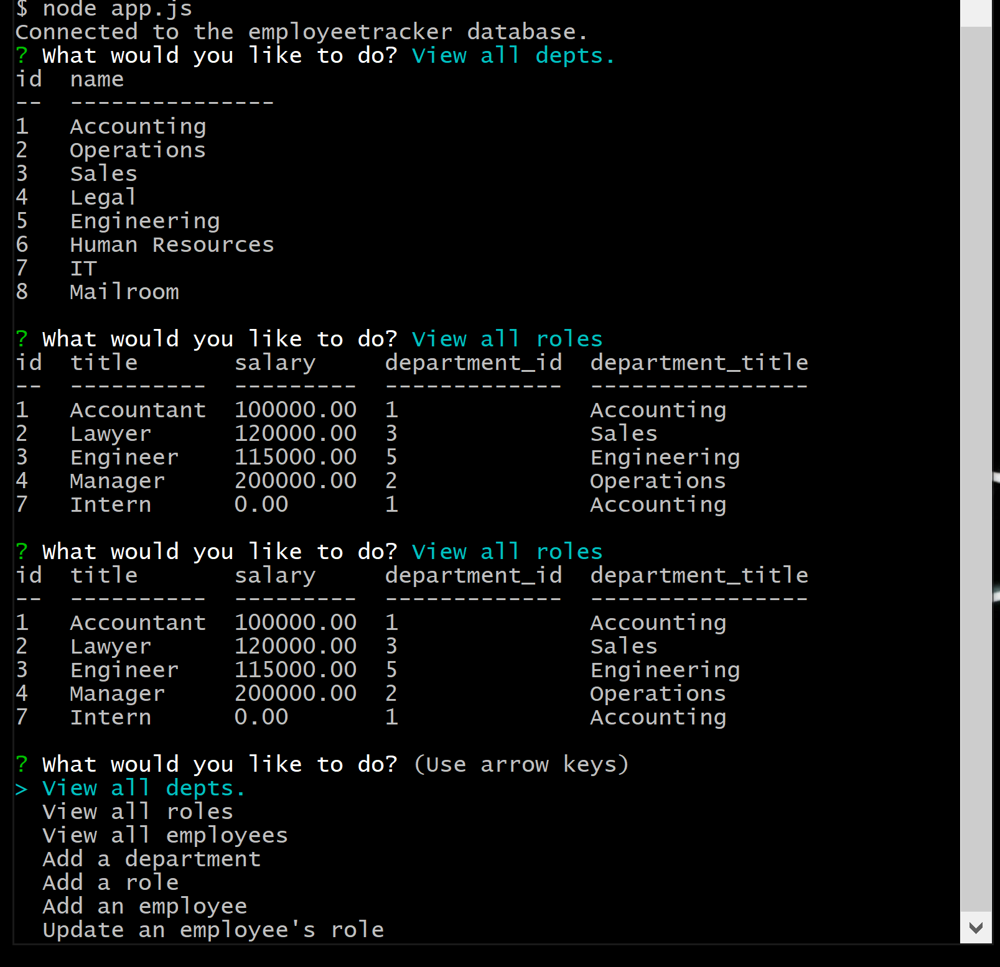

# employee-tracker

## Description

This app allows users to view data stored in the employeetracker database, as well as add data to the database.

## Installation

In order to use this application, the user must first clone this repo. Then, they must run "npm install" from the command line. Finally, they can begin answering the command line prompts by entering "node app.js" into the command line.

## Usage

The user must simply answer the command line prompts. To see the changes they made, they can simply select either "view all employees", "view all departments", or "view all roles" when prompted.

[Watch this video for a walkthrough of the application](https://youtu.be/2SOepwwWRmY)

## Contributing

Made with ❤️ by [Chase McQuown]
